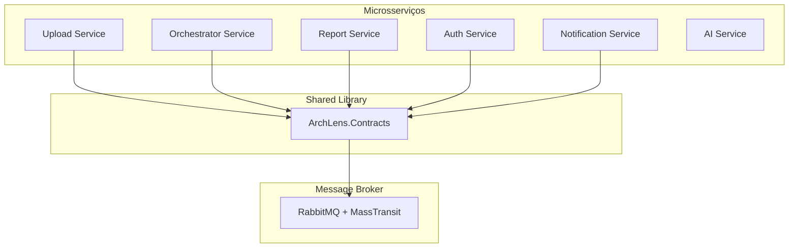
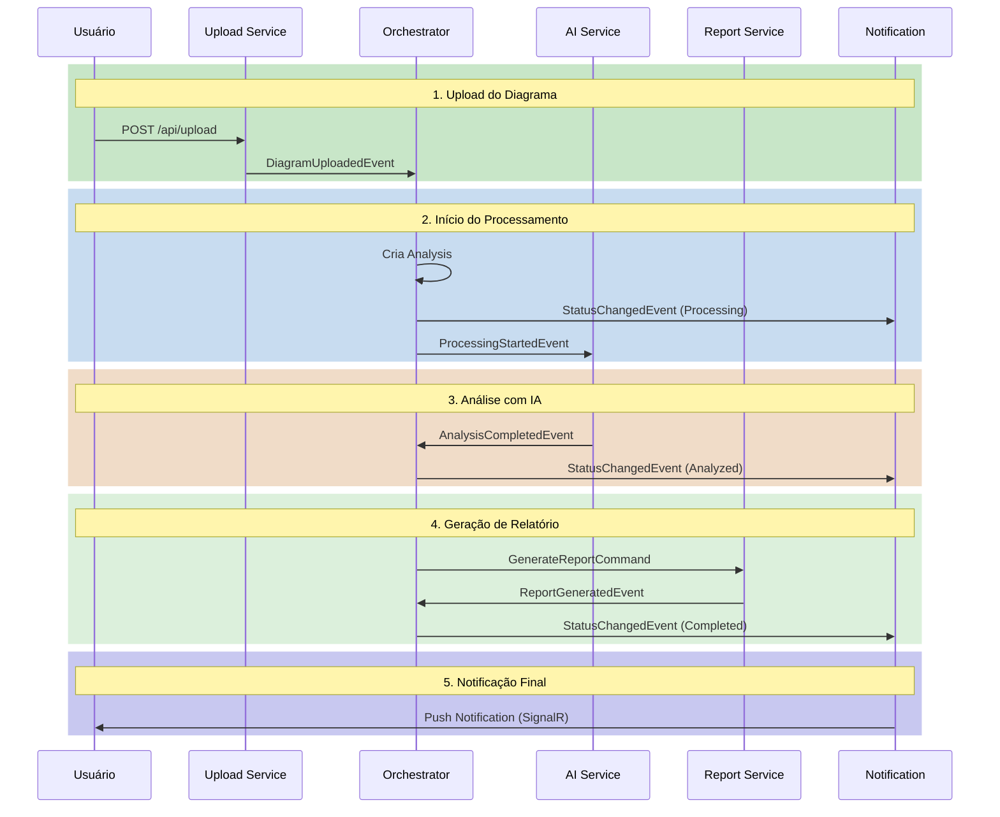
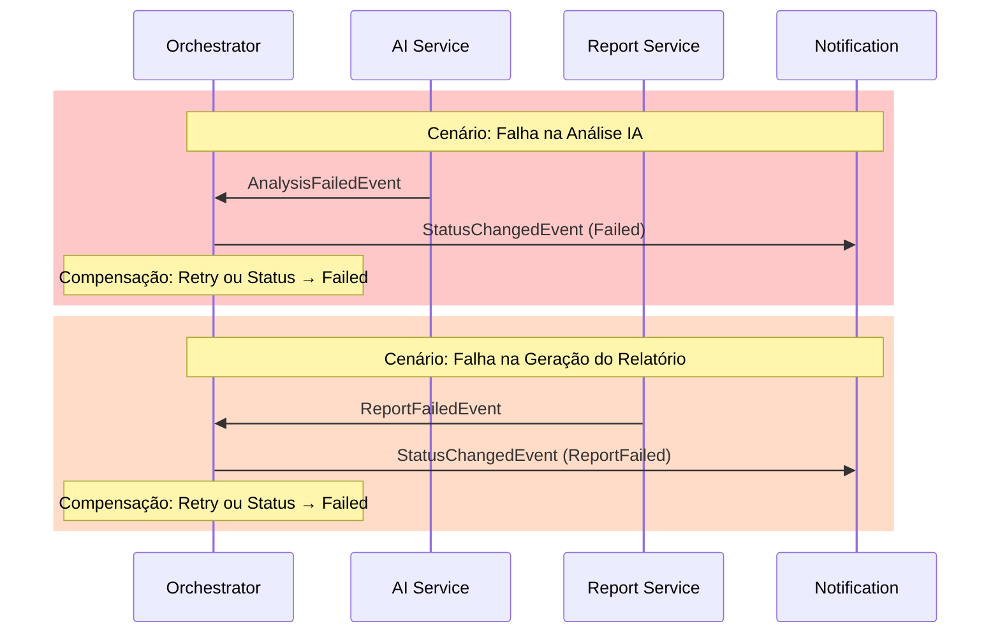
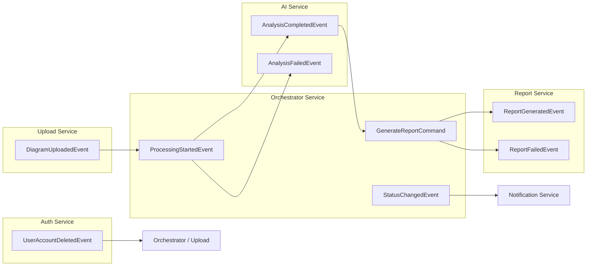

# 📦 ArchLens - Contracts

[](https://github.com/archlens-platform/archlens-contracts/actions/workflows/ci.yml)
[](https://sonarcloud.io/summary/new_code?id=archlens-platform_archlens-contracts)
[](https://sonarcloud.io/summary/new_code?id=archlens-platform_archlens-contracts)
[](https://sonarcloud.io/summary/new_code?id=archlens-platform_archlens-contracts)
[](https://sonarcloud.io/summary/new_code?id=archlens-platform_archlens-contracts)
[](https://sonarcloud.io/summary/new_code?id=archlens-platform_archlens-contracts)
[](https://sonarcloud.io/summary/new_code?id=archlens-platform_archlens-contracts)
[](https://sonarcloud.io/summary/new_code?id=archlens-platform_archlens-contracts)

> **Contratos de Eventos para Comunicação entre Microsserviços**
> Hackathon FIAP - Fase 5 | Pós-Tech Software Architecture + IA para Devs
>
> **Autor:** Rafael Henrique Barbosa Pereira (RM366243)

[](https://dotnet.microsoft.com/)
[](https://masstransit.io/)
[](https://www.rabbitmq.com/)

---

## 📋 Descrição

Biblioteca compartilhada contendo os **contratos de eventos** utilizados na comunicação assíncrona entre os microsserviços do ArchLens via **Saga Orquestrada** com RabbitMQ e MassTransit. Todos os serviços .NET referenciam este projeto para garantir consistência nos payloads de mensagens.

---

## 🏗️ Arquitetura



---

## 🔄 Fluxo Completo da Saga (Happy Path)



---

## 🔥 Fluxo de Compensação (Falhas)



---

## 📡 Mapa de Eventos



---

## 📊 Tabela de Eventos

| Evento | Publicado Por | Consumido Por | Descrição |
|--------|---------------|---------------|-----------|
| `DiagramUploadedEvent` | Upload Service | Orchestrator | Diagrama enviado e armazenado |
| `ProcessingStartedEvent` | Orchestrator | AI Service | Análise iniciada, diagrama pronto para IA |
| `AnalysisCompletedEvent` | AI Service | Orchestrator | Análise IA concluída com sucesso |
| `AnalysisFailedEvent` | AI Service | Orchestrator | Falha na análise IA (compensação) |
| `StatusChangedEvent` | Orchestrator | Notification | Status da análise alterado |
| `GenerateReportCommand` | Orchestrator | Report Service | Comando para gerar relatório |
| `ReportGeneratedEvent` | Report Service | Orchestrator | Relatório gerado com sucesso |
| `ReportFailedEvent` | Report Service | Orchestrator | Falha na geração do relatório (compensação) |
| `UserAccountDeletedEvent` | Auth Service | Orchestrator, Upload | Conta de usuário deletada (LGPD) |

---

## 📦 Estrutura dos Eventos (Payloads)

### DiagramUploadedEvent

| Campo | Tipo | Descrição |
|-------|------|-----------|
| `DiagramId` | `Guid` | ID do diagrama |
| `FileName` | `string` | Nome do arquivo |
| `FileHash` | `string` | Hash SHA-256 do arquivo |
| `StoragePath` | `string` | Caminho no MinIO |
| `UserId` | `string?` | ID do usuario (nullable) |
| `Timestamp` | `DateTime` | Data/hora do upload |

### ProcessingStartedEvent

| Campo | Tipo | Descrição |
|-------|------|-----------|
| `AnalysisId` | `Guid` | ID da analise |
| `DiagramId` | `Guid` | ID do diagrama |
| `StoragePath` | `string` | Caminho do diagrama no MinIO |
| `Timestamp` | `DateTime` | Data/hora do inicio |

### AnalysisCompletedEvent

| Campo | Tipo | Descrição |
|-------|------|-----------|
| `AnalysisId` | `Guid` | ID da analise |
| `DiagramId` | `Guid` | ID do diagrama |
| `ResultJson` | `string` | Resultado consolidado da analise (JSON) |
| `ProvidersUsed` | `IReadOnlyList<string>` | Lista de providers IA utilizados |
| `ProcessingTimeMs` | `long` | Tempo de processamento em milissegundos |
| `Timestamp` | `DateTime` | Data/hora da conclusao |

### AnalysisFailedEvent

| Campo | Tipo | Descrição |
|-------|------|-----------|
| `AnalysisId` | `Guid` | ID da analise |
| `DiagramId` | `Guid` | ID do diagrama |
| `ErrorMessage` | `string` | Mensagem de erro |
| `FailedProviders` | `IReadOnlyList<string>` | Providers que falharam |
| `Timestamp` | `DateTime` | Data/hora da falha |

### StatusChangedEvent

| Campo | Tipo | Descrição |
|-------|------|-----------|
| `AnalysisId` | `Guid` | ID da analise |
| `OldStatus` | `string` | Status anterior |
| `NewStatus` | `string` | Novo status |
| `Timestamp` | `DateTime` | Data/hora da mudanca |

### GenerateReportCommand

| Campo | Tipo | Descrição |
|-------|------|-----------|
| `AnalysisId` | `Guid` | ID da analise |
| `DiagramId` | `Guid` | ID do diagrama |
| `UserId` | `string?` | ID do usuario (nullable) |
| `ResultJson` | `string` | Resultado da analise (JSON) |
| `ProvidersUsed` | `IReadOnlyList<string>` | Providers utilizados |
| `ProcessingTimeMs` | `long` | Tempo de processamento em ms |
| `Timestamp` | `DateTime` | Data/hora da solicitacao |

### ReportGeneratedEvent

| Campo | Tipo | Descrição |
|-------|------|-----------|
| `ReportId` | `Guid` | ID do relatorio |
| `AnalysisId` | `Guid` | ID da analise |
| `DiagramId` | `Guid` | ID do diagrama |
| `Timestamp` | `DateTime` | Data/hora da geracao |

### ReportFailedEvent

| Campo | Tipo | Descrição |
|-------|------|-----------|
| `AnalysisId` | `Guid` | ID da analise |
| `DiagramId` | `Guid` | ID do diagrama |
| `ErrorMessage` | `string` | Mensagem de erro |
| `Timestamp` | `DateTime` | Data/hora da falha |

### UserAccountDeletedEvent

| Campo | Tipo | Descrição |
|-------|------|-----------|
| `UserId` | `Guid` | ID do usuario deletado |
| `Timestamp` | `DateTime` | Data/hora da exclusao |

---

## 📁 Estrutura do Projeto

```
archlens-contracts/
├── src/
│   └── ArchLens.Contracts/
│       ├── Events/
│       │   ├── DiagramUploadedEvent.cs
│       │   ├── ProcessingStartedEvent.cs
│       │   ├── AnalysisCompletedEvent.cs
│       │   ├── AnalysisFailedEvent.cs
│       │   ├── StatusChangedEvent.cs
│       │   ├── GenerateReportCommand.cs
│       │   ├── ReportGeneratedEvent.cs
│       │   ├── ReportFailedEvent.cs
│       │   └── UserAccountDeletedEvent.cs
│       └── ArchLens.Contracts.csproj
└── ArchLens.Contracts.sln
```

---

## 🚀 Como Usar

### Adicionar Referência

```bash
dotnet add reference ../archlens-contracts/src/ArchLens.Contracts/ArchLens.Contracts.csproj
```

### Publicar Evento

```csharp
using ArchLens.Contracts.Events;

await _publishEndpoint.Publish(new DiagramUploadedEvent
{
    DiagramId = diagram.Id,
    UserId = userId,
    FileName = file.FileName,
    StoragePath = storagePath,
    ContentType = file.ContentType,
    UploadedAt = DateTime.UtcNow,
    CorrelationId = Guid.NewGuid()
});
```

### Consumir Evento

```csharp
using ArchLens.Contracts.Events;

public class DiagramUploadedConsumer : IConsumer<DiagramUploadedEvent>
{
    public async Task Consume(ConsumeContext<DiagramUploadedEvent> context)
    {
        var @event = context.Message;

        var analysis = Analysis.Create(
            @event.DiagramId,
            @event.UserId,
            @event.StoragePath
        );

        await _repository.AddAsync(analysis);
    }
}
```

### Registrar Consumer (MassTransit)

```csharp
services.AddMassTransit(x =>
{
    x.AddConsumer<DiagramUploadedConsumer>();

    x.UsingRabbitMq((context, cfg) =>
    {
        cfg.Host("localhost", "/", h =>
        {
            h.Username("guest");
            h.Password("guest");
        });

        // MassTransit kebab-case endpoints
        cfg.ReceiveEndpoint("orchestrator-diagram-uploaded", e =>
        {
            e.ConfigureConsumer<DiagramUploadedConsumer>(context);
        });
    });
});
```

---

## 🛠️ Tecnologias

| Tecnologia | Versão | Descrição |
|------------|--------|-----------|
| .NET | 9.0 | Framework |
| MassTransit | 8.x | Abstração de mensageria (kebab-case endpoints) |
| RabbitMQ | 3.x | Message Broker |

---

## 🔧 Build

```bash
dotnet build
dotnet pack -o ./nupkg
```

---

FIAP - Pós-Tech Software Architecture + IA para Devs | Fase 5 - Hackathon (12SOAT + 6IADT)
